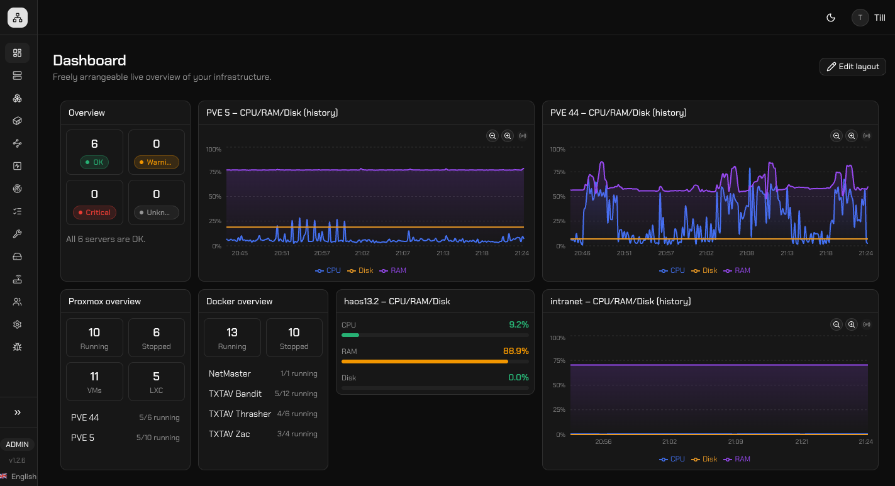
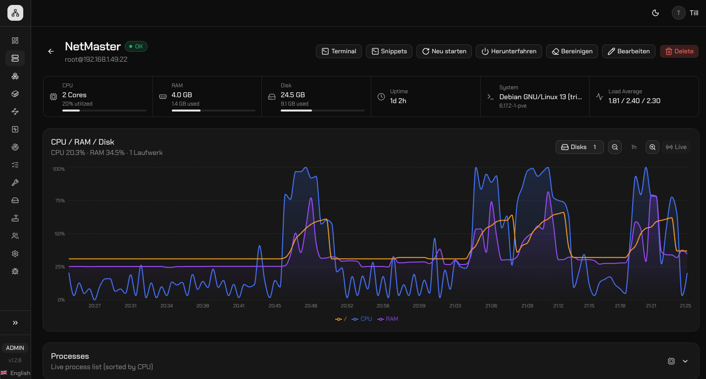
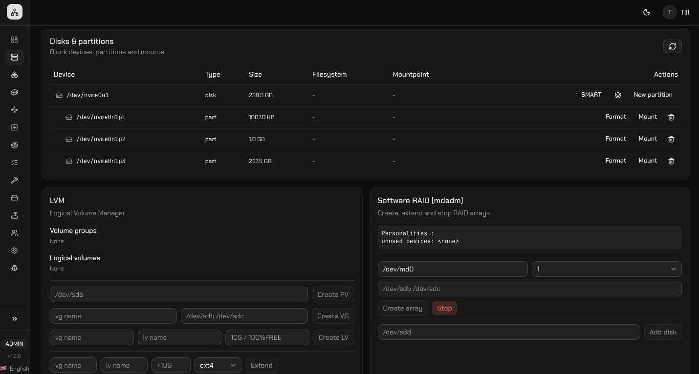
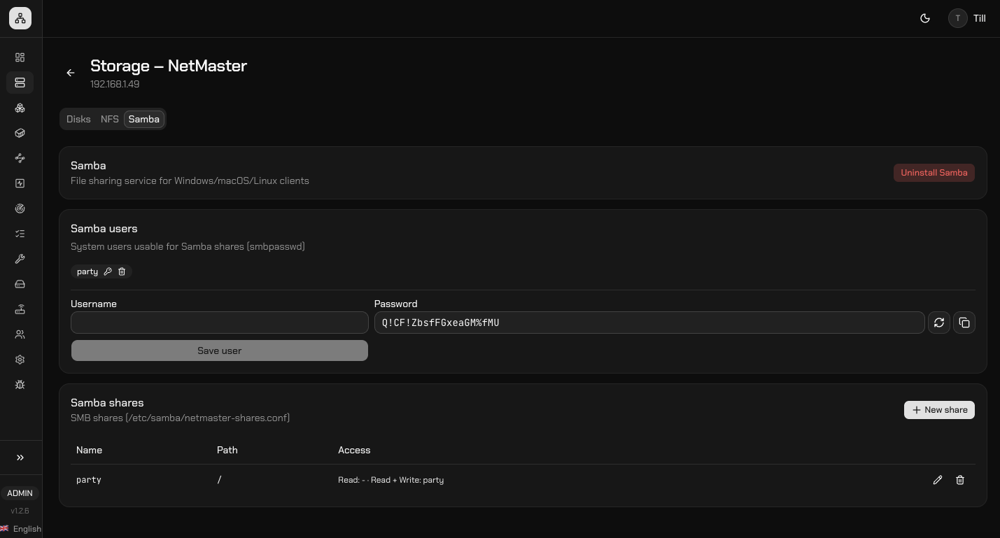
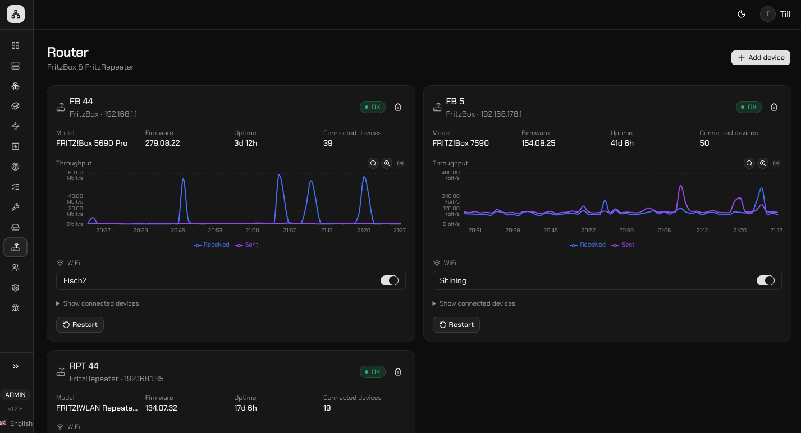
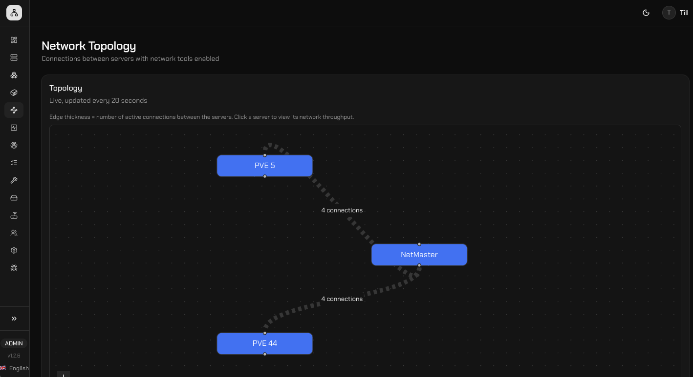

# NetMaster

Self-hosted network admin panel: live monitoring of your servers (CPU/RAM/disk/load/network via SSH), HTTP health checks, a Docker container overview, and a freely arrangeable dashboard – behind a multi-user login with roles (Admin/Editor/Viewer).

## Features

### Dashboard

Freely arrangeable live overview with server status, CPU/RAM/disk history and a Proxmox/Docker summary.



### Servers

Per-server detail view with live CPU/RAM/disk charts, uptime, system info and process list, plus quick actions (terminal, snippets, restart, shutdown).



### Storage

Manage disks, partitions, LVM and software RAID directly on a server, and expose shares via NFS or Samba (users, passwords, permissions).

<table>
<tr>
<td></td>
<td></td>
</tr>
</table>

### Router

Overview of connected FritzBoxes/repeaters with throughput graphs, WiFi status and connected devices.



### Network Topology

Live graph of the connections between servers with network tools enabled.



## Stack

- Next.js 16 (App Router) + TypeScript, Tailwind CSS + shadcn/ui
- Custom Node server (`server.ts`) for WebSocket live updates alongside Next.js
- SQLite via Prisma (`@prisma/adapter-better-sqlite3`)
- SSH monitoring via `ssh2`, encrypted credentials (AES-256-GCM)
- Recharts for live graphs, `react-grid-layout` for the drag-and-drop dashboard

## Installation (Linux server, recommended)

A single command installs Docker (if needed), downloads the latest release,
walks you through a short setup (admin account, port, optional HTTPS via
Caddy + Let's Encrypt) and starts NetMaster:

```bash
curl -fsSL https://raw.githubusercontent.com/mokny/netmaster/main/install.sh | bash
```

Afterwards the `netmaster` command is available:

```bash
netmaster status              # show status & URL
netmaster logs                # live logs
netmaster restart             # restart the container
netmaster update               # update to the latest release (with DB backup)
netmaster update --nightly     # update to the latest main commit
netmaster uninstall            # remove interactively
```

The one-liner is also safe to re-run for updates/repair: an existing
installation is detected automatically and updated instead
(secrets/`.env` are left untouched).

## Local development

```bash
npm install
cp .env.example .env
# set MASTER_SECRET and AUTH_SECRET: openssl rand -hex 32 (run once each)

npx prisma migrate dev
npm run seed        # creates the first admin account (SEED_ADMIN_* from .env)
npm run dev
```

The panel then runs at http://localhost:3000. Log in with the `SEED_ADMIN_*` credentials from `.env`.

## Manual Docker Compose installation

For anyone who doesn't want to use `install.sh` (e.g. an existing Docker host):

```bash
cp .env.example .env
# set MASTER_SECRET, AUTH_SECRET and SEED_ADMIN_PASSWORD in .env

docker compose up --build -d
```

The SQLite database is persisted in the Docker volume `netmaster-data`. Migrations and the admin seed run automatically on container start (`docker-entrypoint.sh`). Optional: set `HOST_PORT` in `.env` to change the port the app listens on (default `3000`). For HTTPS via Caddy + Let's Encrypt: set `COMPOSE_PROFILES=proxy` in `.env` and create a `Caddyfile` (see `install.sh` for an example) that points `reverse_proxy localhost:<HOST_PORT>` at the app.

The `netmaster` container runs with `network_mode: host` (no Docker port mapping) and `cap_add: [NET_ADMIN, NET_RAW]`, so that Explore's network discovery (see below) can see the real LAN – it shares the host's network interface directly. If Caddy is the only intended public entry point, the app's own port should additionally be blocked from outside via the host firewall (`install.sh` does this automatically if a supported firewall is active).

## Explore (network scan)

The "Explore" menu item scans the local network via `nmap` (ARP/ping sweep, followed by port/service discovery for hosts found) and shows which devices aren't yet registered as a server/router in NetMaster.

- **Docker**: only works with `network_mode: host` + `NET_ADMIN`/`NET_RAW` (see above) – without host networking, the scan only sees the isolated Docker bridge network, not the real LAN. `network_mode: host` works on Linux; on Docker Desktop for Mac/Windows it behaves differently or isn't supported.
- **Local development** (`npm run dev`): requires an installed `nmap` binary in `PATH`. Without elevated privileges, the host sweep typically won't return MAC addresses (and hosts without a MAC are skipped) – for complete results locally, consider using `sudo npm run dev`.

## Important environment variables

| Variable | Purpose |
| --- | --- |
| `MASTER_SECRET` | AES-256 key used to encrypt SSH credentials in the DB (64 hex characters) |
| `AUTH_SECRET` | Signing key for login session JWTs (64 hex characters) |
| `SEED_ADMIN_EMAIL` / `SEED_ADMIN_PASSWORD` / `SEED_ADMIN_NAME` | Only used on first start to create the initial admin account |
| `DATABASE_URL` | SQLite path, e.g. `file:./prisma/dev.db` |

## Architecture notes

- Monitoring runs as an in-process scheduler in `server.ts` (`src/lib/monitor/scheduler.ts`), which polls servers/health checks on an interval and distributes results via SQLite + WebSocket broadcast.
- Roles: **Viewer** can only view, **Editor** manages servers/checks/dashboard, **Admin** additionally manages users.
- Docker container metrics are queried over SSH (`docker stats`/`docker ps`) on the target server – no separate agent needed.
